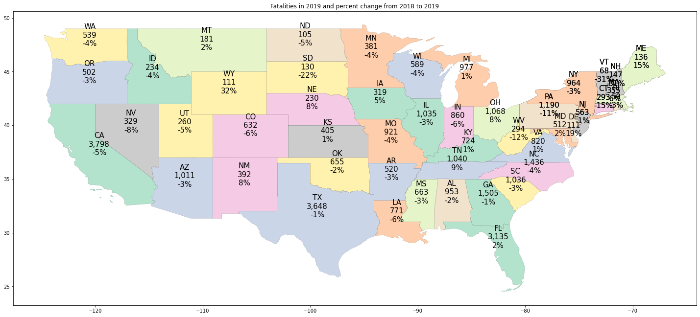
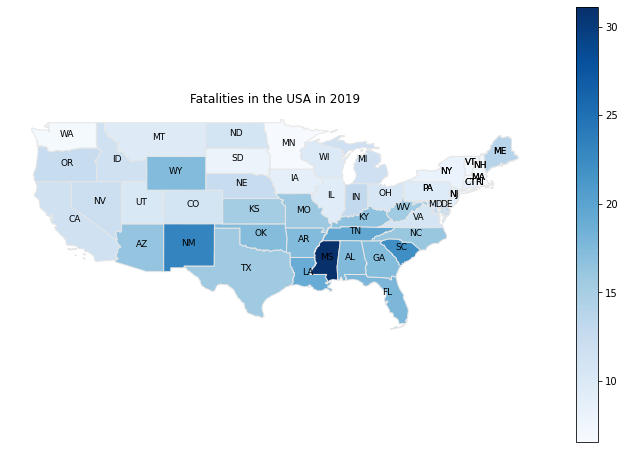
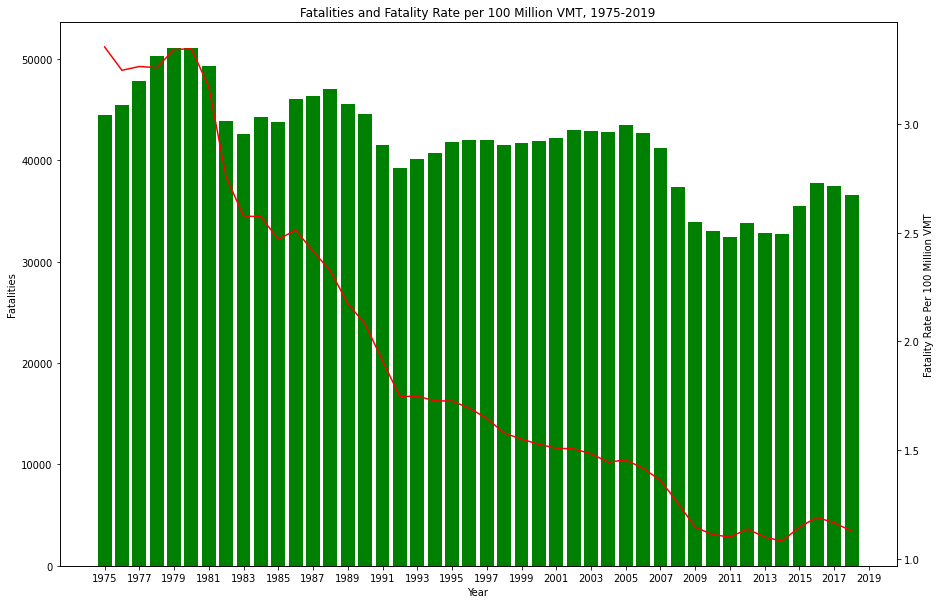
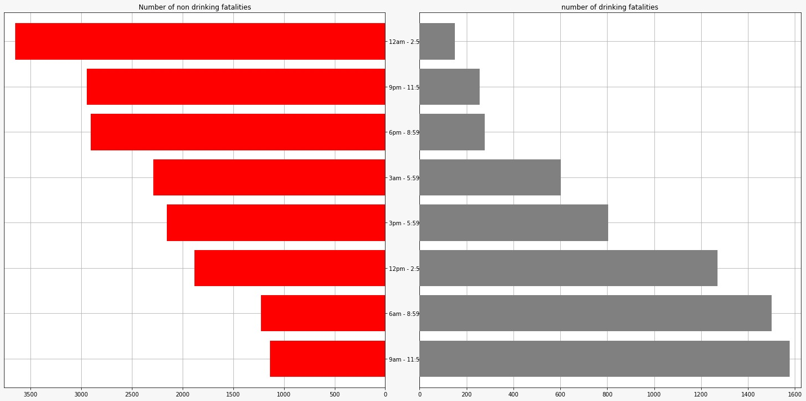
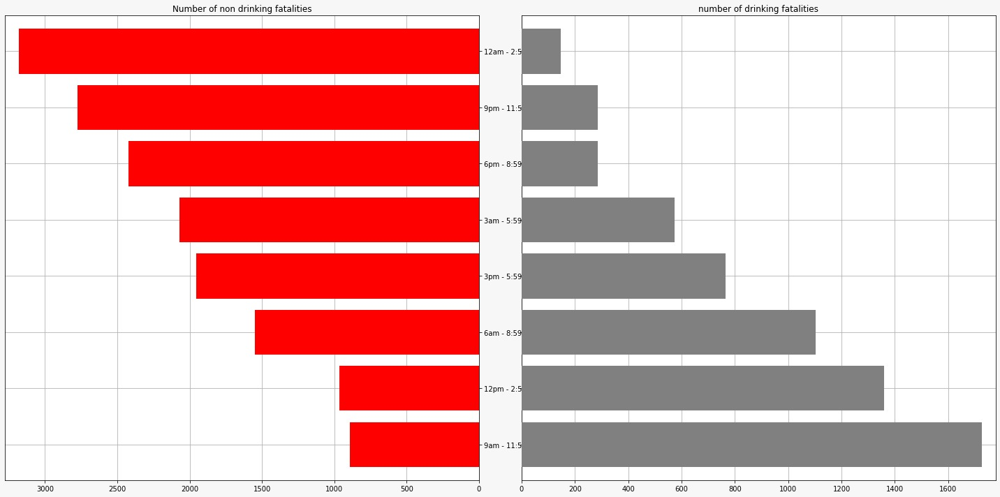

# ANALYSIS OF MOTOR VEHICLE CRASHES IN THE UNITED STATES OF AMERICA

### Overview: 

It is important to analyze how, where and, when the crashes occur. It also helps the law enforcements to understand the nature and injury outcomes of crashes. Our project aims at analyzing these questions. We have referred the NHTSA official report to recreate and check if what they have plotted and analyzed is proper. This has also allowed us to expand on what they have done and what they could have done better in their analysis and plot. Our research has led us to study few hypothesis

Here are few things NHTSA could have done better in order to incorporate a much more precise way of analysing the data

1. They plotted only the number of fatalities in each state of the USA 

This is a perfect graph if we want to analyze just the fatalities but it would make much more sense to Normalize this data with the number of vehicles that are owned by people in a particular state to get a better relative understanding of the severity of crashes beyond the evident data infront of us

This is a Normalized Chloropleth plot of the fatalities which takes into consideration the number of vehicles in each state.

2. They have plotted data for the year of 2019 but if we want to do a year on year analysis, it's not possible. Even in their previous editions they have different graphs, hence it becomes difficult to analyze the changes and trends from the previous years which could allow decision makers to take reasonable and proper action. We have allowed the user to have the liberty to enter the year they want and do a comparitive analysis via the graph which will provide a uniformity in comparison.

3. Since the report did not provide any insight on why there is a upward and downward trend in the number of fatalities per 100million VMT, we have analyzed a few factors and have certain assumptions on what the reason can be.

    1. There is a steep decrease in the fatality rate per 100 Million VMT from 1980 till around 2015.
      
      

      Our assumption is that this is possible because the States became more strict in enforcing restraints in vehicles and hence there were       less number of fatalities during this period
      
    2. There is an increase in this rate from 2015
    
        
        
        Our assumption in this case is that since the gasoline prices saw a decrease in 2016 due to which there is an upward trend in the fatalities, this can be analyzed using the scatter plot as shown
        

<!-- 
NHTSA has done a great job in plotting the fatalities in the states of USA for the year of 2019 using a map, but a better way to plot this graph would have been to first normalize the values based on the number of vehicles and then plot it on the map. This would have allowed them to see fatalities in relative terms and analyze better.  -->

### Hypothesis 1: There are more fatal crashes on weekends (Friday, Saturday, Sunday)

### Hypothesis 2: Fatalities due to drunk driving is independent of time

Step 1:

We first slice the DataFrame into two categories
1. Deaths which involves drunk driving
2. Deaths which does not involve drunk driving
INJ_SEV == 4 or 2 means that the fatalities are cases of drunk driving

Step 2:

Let us observe the plots for 2019, 2016 and 2011

Plot for 2019

Plot for 2016

Plot for 2011

From this graph we can see that there has been higher number of deaths associated with drunk driving during the time of 9am-11am. We could see that from all these graphs that morning and afternoon times have higher deaths associated with drunk driving. Hence we cannot accept the hypothesis that Fatalities due to drunk driving is independent of time but we also cannot reject this hypothesis since we do not have other conclusive evidence against this hypothesis as well.

### Hypothesis 3: Older models of car leads to more fatalities

Step 1 :

We create a new column in the DataFrame to identify vehicle model as "old", "new" or "Not Available" depending on the year of the model

Step 2 : 

Let us observe the plots for 2019, 2016 and 2011

Plot for 2016

Plot for 2019

Plot for 2011

We can see that there are lot of cases of fatalities in the newer model of the car as compared to the older one, we can hence reject our initial hypothesis since the evidence is strongly suggesting against it. The possibility of this can be that there are more number of people who own newer model of cars 

### Hypothesis 4: Fatalities are less in vehicles where airbags are deployed
We have also tested our hypothesis

